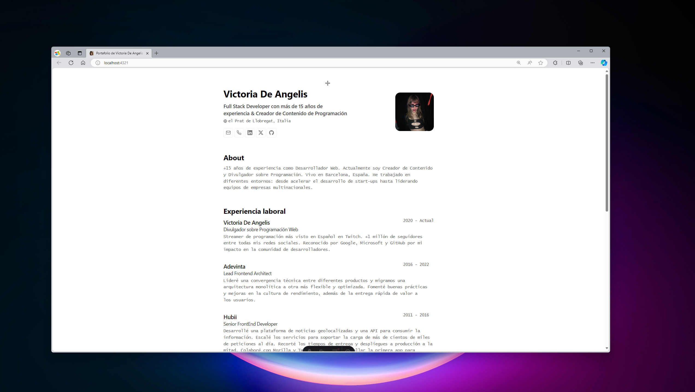

# Astro Starter Kit: Basics

```sh
pnpm create astro@latest -- --template basics
```
<div align="center">
 
<h2>
    <em>Résumé</em> minimalista maquetado para web y pdf
</h2>
<p>
Esquema del JSON de CV de <a href="https://jsonresume.org/schema/">jsonresume.org</a>
</p>


<p>
Basado en el diseño de <a href="https://github.com/BartoszJarocki/cv">Bartosz Jarocki</a>

</p>

</div>

<div align="center">
    <a href="#🚀-empezar">
        Empezar
    </a>
    <span>&nbsp;✦&nbsp;</span>
    <a href="#🧞-comandos">
        Comandos
    </a>
    <span>&nbsp;✦&nbsp;</span>
    <a href="#🔑-licencia">
        Licencia
    </a>
    <span>&nbsp;✦&nbsp;</span>
    <a href="https://midu.dev">
        Personal
    </a>
   
</div>

<p></p>

<div align="center">


</div>

</img>

## 🛠️ Stack

- [**Astro**](https://astro.build/) - El framework web de la nueva época.
- [**Typescript**](https://www.typescriptlang.org/) - JavaScript con sintaxis de tipado.
- [**Ninja Keys**](https://github.com/ssleptsov/ninja-keys) - Menu desplegable con atajos de teclado hecho en puro Javascript.


## 🚀 Empezar

### 1. Usa este [repo](https://github.com/midudev/minimalist-portfolio-json) como _template_ de un proyecto de Astro


- Yo uso [pnpm](https://pnpm.io/installation) como gestor de dependencias y empaquetador.

```bash
# Activa pnpm en MacOS, WSL & Linux:
corepack enable
corepack prepare pnpm@latest --activate

# Inicializa el proyecto
pnpm create astro@latest -- --template midudev/minimalist-portfolio-json
```

### 2. Añade tu contenido:
Edita el archivo `cv.json` para crear tu propio Portafolio/CV imprimible.
### 3. Lanza el servidor de desarrollo:

```bash
# Disfruta del resultado
pnpm dev
```


## 🚀 Project Structure
Inside of your Astro project, you'll see the following folders and files:

```text
└── 📁minimalist-portfolio
    └── .gitignore
    └── .prettierrc.mjs
    └── 📁.vscode
        └── extensions.json
        └── launch.json
    └── astro.config.mjs
    └── cv.json
    └── logo.png
    └── package.json
    └── pnpm-lock.yaml
    └── portada.png
    └── 📁public
        └── favicon.svg
        └── me.jpg
        └── victoria-de-angelis.jpg
        └── victoria-de-angelis1.png
    └── README.md
    └── 📁src
        └── 📁components
            └── KeyboardManager.astro
            └── Section.astro
            └── 📁sections
                └── About.astro
                └── Education.astro
                └── Experience.astro
                └── Hero.astro
                └── Projects.astro
                └── Skills.astro
        └── cv.d.ts
        └── env.d.ts
        └── 📁icons
            └── GitHub.astro
            └── LinkedIn.astro
            └── Mail.astro
            └── Phone.astro
            └── WorldMap.astro
            └── X.astro
        └── 📁layouts
            └── Layout.astro
        └── 📁pages
            └── index.astro
        └── types.d.ts
    └── tsconfig.json
```

1. Abre [**http://localhost:4321**](http://localhost:4321/) en tu navegador para ver el resultado 🚀


## 🧞 Comandos

|     | Comando          | Acción                                        |
| :-- | :--------------- | :-------------------------------------------- |
| ⚙️  | `dev` o `start` | Lanza un servidor de desarrollo local en  `localhost:4321`.  |
| ⚙️  | `build`          | Comprueba posibles errores y hace un empaquetado de producción en `./dist/`.      |
| ⚙️  | `preview`        | Vista previa en local `localhost:4321` |


Astro looks for `.astro` or `.md` files in the `src/pages/` directory. Each page is exposed as a route based on its file name.

There's nothing special about `src/components/`, but that's where we like to put any Astro/React/Vue/Svelte/Preact components.

Any static assets, like images, can be placed in the `public/` directory.

## 🧞 Commands

All commands are run from the root of the project, from a terminal:

| Command                   | Action                                           |
| :------------------------ | :----------------------------------------------- |
| `pnpm install`             | Installs dependencies                            |
| `pnpm run dev`             | Starts local dev server at `localhost:4321`      |
| `pnpm run build`           | Build your production site to `./dist/`          |
| `pnpm run preview`         | Preview your build locally, before deploying     |
| `pnpmm run astro ...`       | Run CLI commands like `astro add`, `astro check` |
| `pnpm run astro -- --help` | Get help using the Astro CLI                     |

## 👀 Want to learn more?

Feel free to check [our documentation](https://docs.astro.build) or jump into our [Discord server](https://astro.build/chat).
## 🔑 Licencia

